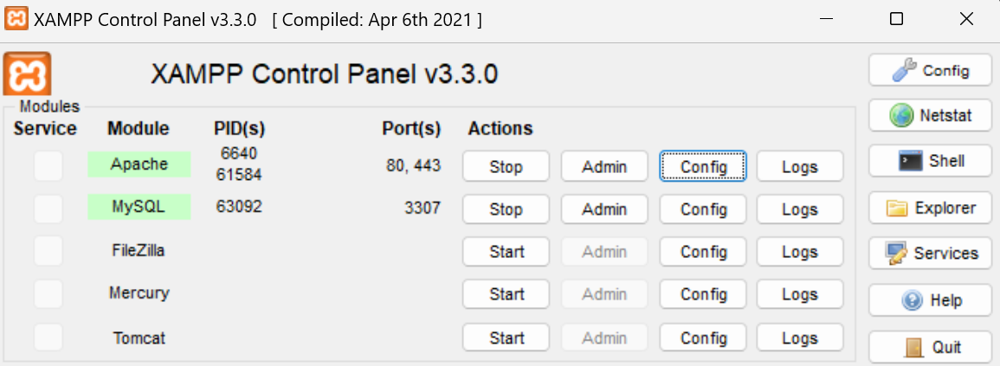
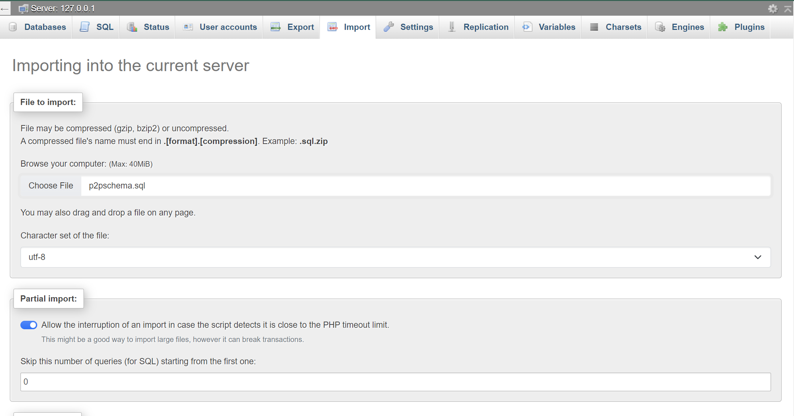

<a name="readme-top"></a>

<!-- PROJECT LOGO -->
<br />
<div align="center">
  <a href="https://github.com/Danke86/group6_project127">
    
  </a>

<h3 align="center">P2P: A lending tracker app</h3>

  <p align="center">
    This project was made and developed by Group 6 in partial fulfillment of the requirements of CMSC 127 - 2nd Semester S.Y. 2022-2023.
  </p>
</div>

<!-- ABOUT THE PROJECT -->
## About The Project
P2P is a lending tracker app to track loans or expenses you do together with other people. This app can track expenses made with a single friend or a group of people. It also keeps track of payments and can calculate overall and specific (friend or group) of outstanding balances. 


<p align="right">(<a href="#readme-top">back to top</a>)</p>


### Built With

* ![HTML][html-badge]
* ![CSS][css-badge]
* [![Bootstrap][getbootstrap.com]][bootstrap-url]
* [![PHP][php.net]][php-url]
* [![JQuery][JQuery.com]][JQuery-url]

<p align="right">(<a href="#readme-top">back to top</a>)</p>


<!-- GETTING STARTED -->
## Getting Started
### Prerequisites

* Stable Internet Connection (for CSS libraries and Ajax)
* [XAMPP](www.apachefriends.org)

### Installation

1. Install XAMPP on your device
2. Clone the repository on the `htdocs` folder in your XAMPP install location
   ```bash
   cd xampp/htdocs
   git clone https://github.com/github_username/repo_name.git
   ```
3. Open the XAMPP Control Panel and start `Apache` and `MySQL` modules
    <div align = "center">
      
    </div>
  - Note: Please make sure that port `3306` is available or terminate `mysqld.exe` in task manager
4. Open MySQL admin and import `p2pschema.sql`
    <div>
      
    </div>
5. Open up a browser and go to
    ```shell
    localhost/group6_project127/index.php
    ```

<p align="right">(<a href="#readme-top">back to top</a>)</p>


## Project Developers

* Njord Daniel P. Cinense - [Danke86](https://github.com/Danke86)
* Aira Nicole Natividad - [airanatividad](https://github.com/airanatividad)
* Jaymart G. Latigay - [jaymart-latigay](https://github.com/jaymart-latigay) 

Project Link: [P2P](https://github.com/Danke86/group6_project127)

<p align="right">(<a href="#readme-top">back to top</a>)</p>


<!-- MARKDOWN LINKS & IMAGES -->
<!-- https://www.markdownguide.org/basic-syntax/#reference-style-links -->
[JQuery.com]: https://img.shields.io/badge/jQuery-0769AD?style=for-the-badge&logo=jquery&logoColor=white
[JQuery-url]: https://jquery.com 
[php.net]: https://img.shields.io/badge/php-0769AD?style=for-the-badge&logo=php&logoColor=white
[php-url]: https://php.net
[html-badge]: https://img.shields.io/badge/HTML-239120?style=for-the-badge&logo=html5&logoColor=white
[css-badge]: https://img.shields.io/badge/CSS-239120?&style=for-the-badge&logo=css3&logoColor=white
[getbootstrap.com]: https://img.shields.io/badge/Bootstrap-563D7C?style=for-the-badge&logo=bootstrap&logoColor=white
[bootstrap-url]: https://getbootstrap.com/